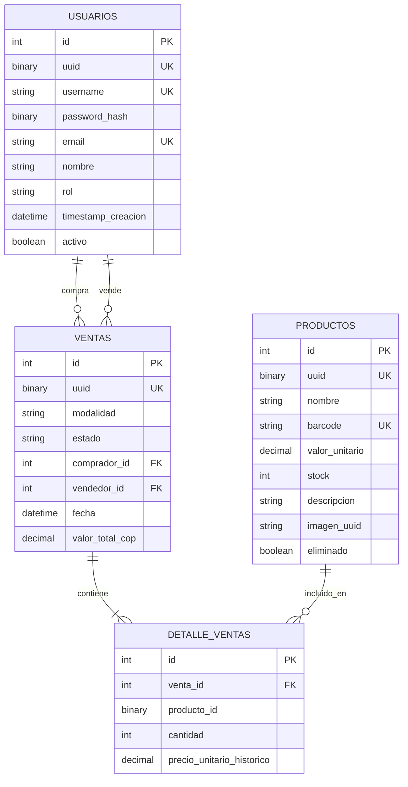

# 💊 Apotheclean

Sistema de farmacia para venta, registro de productos y reportes. Backend con arquitectura hexagonal y frontend en React.

## 🛠️ Stack Tecnológico

- **Backend**: Python, Flask, SQLAlchemy (ORM)
- **Base de datos**: SQLite
- **Cache**: Redis
- **Autenticación**: JWT (bcrypt para hash de contraseñas)
- **Contenedores**: Docker, Docker Compose

## 📋 Requisitos Previos

- Docker y Docker Compose
- (Opcional para desarrollo local) Python 3.14+ y [uv](https://docs.astral.sh/uv/)

## 🚀 Inicio Rápido con Docker

### 1. Configurar variables de entorno

```bash
cp .env.example .env
# Editar .env con tus valores (especialmente JWT_SECRET_KEY y REDIS_PASSWORD)
```

### 2. Levantar los servicios

```bash
docker compose up --build
```

La API estará disponible en: `http://localhost:5000`

### 3. Crear usuario administrador

```bash
docker exec -it apotheclean-backend python -m scripts.crear_admin
```

> ⚠️ Los administradores solo pueden crearse mediante este script (regla de negocio).

## 🔧 Desarrollo Local (sin Docker)

```bash
# Instalar dependencias
uv sync

# Ejecutar aplicación
JWT_SECRET_KEY="tu_clave_secreta" uv run python -m src.main

# Ejecutar tests
uv run pytest
```

## 📡 Endpoints de la API

### Autenticación

| Método | Endpoint | Descripción | Auth |
|--------|----------|-------------|------|
| POST | `/api/auth/registro` | Registrar usuario cliente | ❌ |
| POST | `/api/auth/login` | Iniciar sesión | ❌ |

### Productos

| Método | Endpoint | Descripción | Auth |
|--------|----------|-------------|------|
| GET | `/api/productos` | Listar productos | ❌ |
| GET | `/api/productos/<uuid>` | Obtener producto | ❌ |
| POST | `/api/productos` | Crear producto | 🔐 Admin |
| PUT | `/api/productos/<uuid>` | Actualizar producto | 🔐 Admin |
| DELETE | `/api/productos/<uuid>` | Eliminar producto (soft) | 🔐 Admin |

### Ventas

| Método | Endpoint | Descripción | Auth |
|--------|----------|-------------|------|
| POST | `/api/ventas` | Crear venta | 🔐 |
| GET | `/api/ventas/<uuid>` | Obtener venta | 🔐 |
| POST | `/api/ventas/<uuid>/completar` | Completar venta | 🔐 |
| POST | `/api/ventas/<uuid>/cancelar` | Cancelar venta | 🔐 |
| GET | `/api/ventas/reporte` | Reporte de ventas | 🔐 Admin |

### Health Check

```bash
curl http://localhost:5000/health
```

## 🗄️ Modelo de Base de Datos



## 🔍 Consultar la Base de Datos

```bash
# Acceder a SQLite dentro del contenedor
docker exec -it apotheclean-backend sqlite3 /app/data/farmacia.db

# Comandos útiles dentro de SQLite
.tables                    -- Ver tablas
SELECT * FROM usuarios;    -- Ver usuarios
SELECT * FROM productos;   -- Ver productos
.quit                      -- Salir
```

## 📁 Estructura del Proyecto

```
src/
├── domain/           # Entidades y reglas de negocio
├── application/      # Casos de uso y puertos
│   ├── ports/        # Interfaces (puertos)
│   └── use_cases/    # Casos de uso
└── infraestructure/  # Adaptadores
    ├── adapters/     # Implementaciones de repositorios
    ├── api/          # Flask app y rutas
    ├── auth/         # JWT adapter
    ├── cache/        # Redis adapters
    └── storage/      # Almacenamiento de imágenes
```

## 📄 Licencia

[Ver LICENSE](LICENSE)