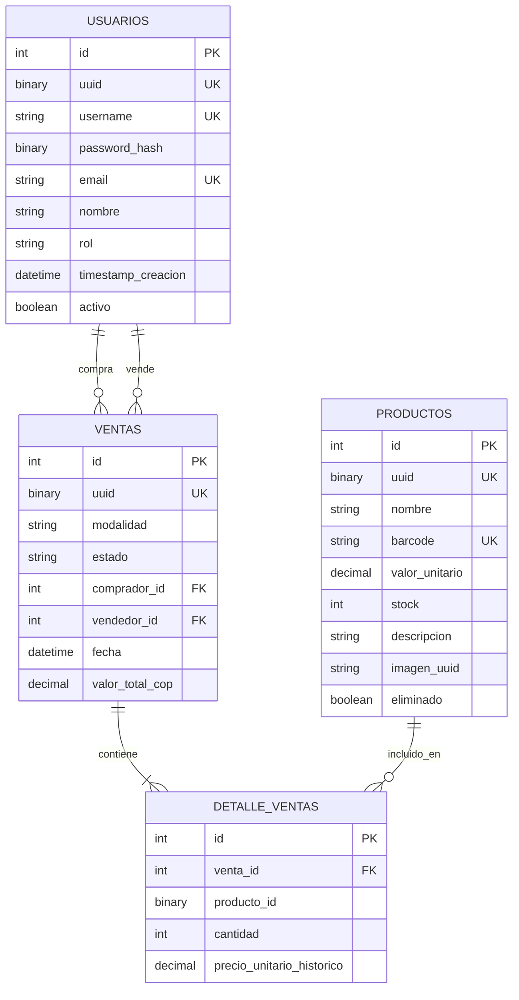

```mermaid
erDiagram
    USUARIOS {
        int id PK
        binary uuid UK
        string username UK
        binary password_hash
        string email UK
        string nombre
        string rol
        datetime timestamp_creacion
        boolean activo
    }

    PRODUCTOS {
        int id PK
        binary uuid UK
        string nombre
        string barcode UK
        decimal valor_unitario
        int stock
        string descripcion
        string imagen_uuid
        boolean eliminado
    }

    VENTAS {
        int id PK
        binary uuid UK
        string modalidad
        string estado
        int comprador_id FK
        int vendedor_id FK
        datetime fecha
        decimal valor_total_cop
    }

    DETALLE_VENTAS {
        int id PK
        int venta_id FK
        binary producto_id
        int cantidad
        decimal precio_unitario_historico
    }

    USUARIOS ||--o{ VENTAS : "compra"
    USUARIOS ||--o{ VENTAS : "vende"
    VENTAS ||--|{ DETALLE_VENTAS : "contiene"
    PRODUCTOS ||--o{ DETALLE_VENTAS : "incluido_en"
```