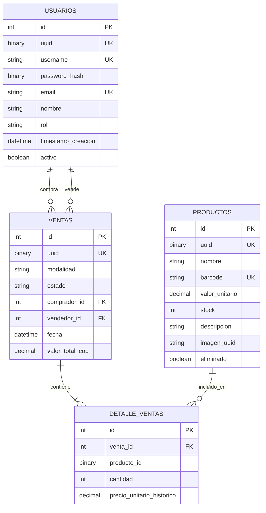

# Apotheclean

Sistema de farmacia para venta, registro de productos y reportes. Construido con una Arquitectura Hexagonal en el backend y una interfaz moderna en React.

## Caracteristicas Principales

### Arquitectura Hexagonal (Ports & Adapters)
El nucleo de la logica de negocio (domain y application) esta completamente desacoplado de la infraestructura (frameworks, bases de datos).
- Puertos: Interfaces que definen los contratos (IProductoRepository, IImageStorage).
- Adaptadores: Implementaciones concretas (SqlAlchemyRepository, FilesystemImageAdapter).

### Patrones de Resiliencia
Implementacion robusta para manejar fallos transitorios:
- Circuit Breaker: Utilizando la libreria Tenacity, protegemos las operaciones criticas de base de datos para evitar cascadas de fallos.
- Retries: Configuracion automatica de reintentos con backoff exponencial.

### Mock de Blob Storage
Simulacion de un servicio de almacenamiento en la nube (S3/Azure Blob) utilizando el sistema de archivos local (FilesystemImageAdapter). Las imagenes se guardan como objetos utilizando su UUID, sin depender de estructuras de carpetas complejas.

### Seguridad
- Autenticacion JWT: Tokens seguros para manejo de sesiones.
- Roles: Separacion estricta entre Administrador y Usuario.
- Hashing: Contrasenas almacenadas de forma segura con bcrypt.

## Funcionalidades de la Aplicacion

### Panel de Administrador
- **Gestion de Productos**: CRUD completo (Crear, Leer, Actualizar, Eliminar). Soporte para carga de imagenes y  control de stock.
- **Reportes Avanzados**: Visualizacion de ventas con graficas interactivas, filtrado por rango de fechas y paginacion de resultados.
- **Historial de Ventas**: Vista detallada de todas las transacciones realizadas tanto en punto fisico como virtual.

### Pagina de Venta para Clientes (Tienda Virtual)
- **Catalogo de Productos**: Exploracion de productos disponibles con imagenes y precios en tiempo real.
- **Carrito de Compras**: Gestion de items seleccionados, calculo automatico de totales y persistencia temporal del carrito.
- **Checkout**: Proceso simplificado para completar la compra.

### Gestion de Ventas
- **Punto de Venta Fisico**: Interfaz optimizada para que los administradores registren ventas en el local rapidamente.
- **Venta Virtual**: Flujo de compra completo para clientes remotos.
- **Facturacion**: Generacion de registros de venta inmutables.

---

## Stack Tecnologico

### Backend
- Python 3.12+
- Flask (API REST)
- SQLAlchemy (ORM)
- Redis (Cache & Carrito de Compras)
- Pydantic (Validacion de datos)
- Tenacity (Resiliencia)

### Frontend
- React 19
- Vite
- TailwindCSS (Estilos)
- Recharts (Graficos y Reportes)

### Infraestructura
- Docker & Docker Compose
- SQLite (Base de datos local)

---

## Guia de Ejecucion

1. Clonar el repositorio:
   ```bash
   git clone https://github.com/juanchlo/Apotheclean
   cd Apotheclean
   ```

### Opcion A: Docker (Recomendado)
La forma mas sencilla de levantar todo el ecosistema.

1. Configurar entorno:
   Copie el archivo .env.example a .env y ajuste los valores si es necesario.
   ```bash
   cp .env.example .env
   ```

2. Iniciar servicios:
   ```bash
   docker compose up --build
   ```
   - Frontend: http://localhost
   - Backend API: http://localhost:5000

3. Crear usuario Administrador:
   ```bash
   docker exec -it apotheclean-backend python -m scripts.crear_admin
   ```
   Nota: Por reglas de negocio, los administradores solo se crean mediante CLI.

### Opcion B: Ejecucion Local

#### Backend
1. Instalar dependencias (se recomienda usar uv o venv):
   ```bash
   cd backend
   uv sync
   # O con pip tradicional:
   # pip install -r requirements.txt
   ```
2. Ejecutar servidor:
   ```bash
   python -m src.main
   ```

#### Frontend
1. Instalar dependencias:
   ```bash
   cd frontend
   npm install
   ```
2. Iniciar servidor de desarrollo:
   ```bash
   npm run dev
   ```
   - Frontend disponible en: http://localhost:5173

---


## Modelo de Base de Datos



## Estructura del Proyecto

```
Apotheclean/
├── backend/
│   ├── src/
│   │   ├── domain/           # Entidades y logica pura
│   │   ├── application/      # Casos de uso y Puertos
│   │   ├── infraestructure/  # Adaptadores (API, DB, Storage)
│   │   └── main.py           # Punto de entrada
│   └── tests/                # Pruebas unitarias y de integracion
├── frontend/
│   ├── src/
│   │   ├── components/       # Componentes React reutilizables
│   │   ├── pages/            # Vistas principales
│   │   └── services/         # Comunicacion con API
└── docker-compose.yml        # Orquestacion de contenedores
```

## Testing

Las pruebas unitarias deben ejecutarse localmente, ya que la imagen de Docker de produccion no incluye las dependencias de desarrollo.

```bash
cd backend
uv run pytest
```

## Notas sobre los Datos
Este repositorio incluye archivos de base de datos (farmacia.db) y una carpeta de imagenes precargadas en backend/data/. Esto permite probar la aplicacion inmediatamente sin necesidad de poblar datos desde cero.

---

## Licencia
MIT